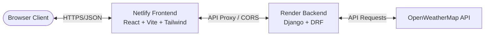

# Weather Dashboard 🌦️

A premium, modern, responsive weather dashboard built with React on the frontend and Django REST Framework on the backend. It offers real-time weather details, 5-day forecasts, historical trends visualization, and data exports (CSV/Excel).

## Live Application

The frontend is deployed on Netlify:
🔗 **[Weather Dashboard Live Site](https://6a3a5c59cb0eb31dcfa678fc--spontaneous-alpaca-2f6b9f.netlify.app/)**

The backend API is deployed on Render:
🔗 **`https://weather-dashboard-sw80.onrender.com`**

---

## Architecture



- **Frontend**: Single Page Application (SPA) built using React, Vite, Tailwind CSS, and Recharts. Hosted on **Netlify**.
- **Backend**: API server built using Django and Django REST Framework. Hosted on **Render**.
- **Database**: SQLite database for storing data export records and log history.
- **Third-Party API**: OpenWeatherMap API for querying live coordinates, current weather, and forecasts.

---

## Features

- **Live Weather Conditions**: Get temperature, description, feels-like temperature, humidity, wind speed, visibility, and cloud cover.
- **5-Day Forecast**: Visual cards showcasing the daily conditions and temperature ranges for the next 5 days.
- **Historical Trends**: Beautiful interactive line chart tracking temperatures and humidity metrics.
- **Data Exporting**: Export customized range of weather reports to Excel (.xlsx) or CSV format.
- **Export Logs**: Records and displays past export attempts.
- **Theme Toggle**: Sleek Dark/Light mode support with state preserved in local storage.

---

## Local Setup

### 1. Prerequisites
- Node.js (v18+)
- Python 3.12+
- OpenWeatherMap API key

### 2. Backend Setup (Django)
1. Clone the repository and navigate to the project directory.
2. Create and activate a Python virtual environment:
   ```bash
   python -m venv venv
   source venv/bin/activate  # On Windows use: venv\Scripts\activate
   ```
3. Install dependencies:
   ```bash
   pip install -r requirements.txt
   ```
4. Set up your `.env` file in the root:
   ```env
   DEBUG=True
   SECRET_KEY=your-django-secret-key
   OPENWEATHER_API_KEY=your-openweathermap-api-key
   CORS_ALLOWED_ORIGINS=http://localhost:5173,http://127.0.0.1:5173
   ALLOWED_HOSTS=localhost,127.0.0.1
   ```
5. Apply database migrations:
   ```bash
   python manage.py migrate
   ```
6. Start the development server:
   ```bash
   python manage.py runServer
   ```

### 3. Frontend Setup (React/Vite)
1. Install npm dependencies:
   ```bash
   npm install
   ```
2. Run the Vite development server:
   ```bash
   npm run dev
   ```
3. Open `http://localhost:5173` in your browser. All requests to `/api/` will be proxied automatically to `http://localhost:8000`.

---

## Production Deployment Notes

### Netlify Frontend configuration
- **Build Command**: `npm run build`
- **Publish Directory**: `weather/static` (matching `vite.config.js` build output directory)
- **API Proxy Routing**: Handled seamlessly by `netlify.toml` in the project root. Netlify proxies `/api/*` requests directly to Render backend, avoiding CORS configuration overhead and potential browser issues.

### Render Backend configuration
- **Build Command**: `pip install -r requirements.txt && python manage.py collectstatic --noinput && python manage.py migrate`
- **Start Command**: `gunicorn django_app.wsgi:application --bind 0.0.0.0:$PORT`
- **Environment Variables**:
  - `DEBUG`: `False`
  - `OPENWEATHER_API_KEY`: *(Your OpenWeather API Key)*
  - `CORS_ALLOWED_ORIGINS`: `https://6a3a5c59cb0eb31dcfa678fc--spontaneous-alpaca-2f6b9f.netlify.app`
